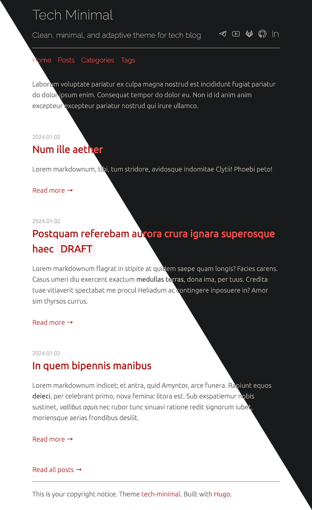

# hugo-theme-tech-minimal



## Features

- Automagically supports dark/light mode
- Allows HTML markup in title
- Allows HTML markup in subtitle
- Strips footnote leftovers in summaries :heart_eyes_cat:

## Installation

```shell
git submodule add \
  https://github.com/petr-korobeinikov/hugo-theme-tech-minimal \
  themes/hugo-theme-tech-minimal
```

## Configuration

See `exampleSite/hugo.toml` for example.

```toml
...

[params]
subtitle = 'Clean, minimal, and adaptive theme for tech blog'
postsPerHomePage = 3

...
```

## Page Speed

- https://pagespeed.web.dev/analysis/https-petr-korobeinikov-github-io-hugo-theme-tech-minimal/b0m75saw5j?form_factor=desktop

## Development

```shell
hugo server \
  --themesDir ../.. \
  --theme hugo-theme-tech-minimal \
  --source exampleSite \
  --buildDrafts \
  --gc \
  --noBuildLock \
  --noHTTPCache
```

## Thanks

This theme heavily inspired by vividvilla/ezhil.

Special thanks to @jaspervdj for markdown lorem ipsum generator with HTTP API:

- https://jaspervdj.be/lorem-markdownum/
- https://github.com/jaspervdj/lorem-markdownum
