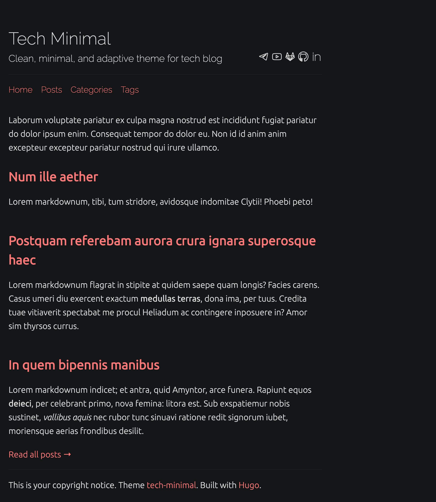
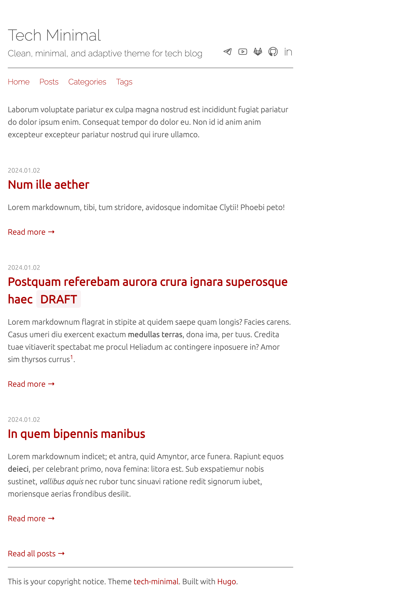

# hugo-theme-tech-minimal

### Dark theme



### Light theme



## Features

## Installation

## Configuration

## Page Speed

- https://pagespeed.web.dev/analysis/https-petr-korobeinikov-github-io-hugo-theme-tech-minimal/b0m75saw5j?form_factor=desktop

## Development

```shell
hugo server \
  --themesDir ../.. \
  --theme hugo-theme-tech-minimal \
  --source exampleSite \
  --buildDrafts \
  --gc \
  --noBuildLock \
  --noHTTPCache
```

## Thanks

This theme heavily inspired by vividvilla/ezhil.

Special thanks to @jaspervdj for markdown lorem ipsum generator with HTTP API:

- https://jaspervdj.be/lorem-markdownum/
- https://github.com/jaspervdj/lorem-markdownum
